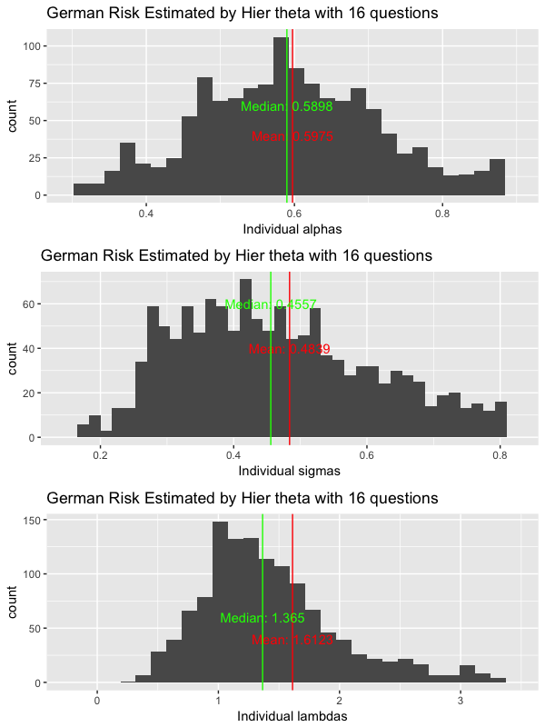

[](https://www8.gsb.columbia.edu/decisionsciences/)

# DEEPEst

This R package provides functions to execute hierarchical Bayesian estimation for DEEP using [Stan](https://mc-stan.org) (via the **rstan** package). These high level functions will automatically call [Stan](https://mc-stan.org) functions so that you don't need to dive into them by yourself. There are also some functions for posterior analysis on estimates of both time and risk preferences parameters.

### Dynamic Experiments for Estimating Preferences (DEEP)

In trying to understand choices, people would like to know the decision maker's underlying preferences. DEEP (Toubia et al, 2013) is a novel methodology to elicit individuals' risk (DEEP Risk) or time (DEEP Time) preferences by dynamically (i.e., adaptively) optimizing the sequences of questions presented to each subject, while leveraging information about the distribution of the parameters across individuals (heterogeneity) and modeling response error explicitly.

To customize and launch your own DEEP survey, refer to our [survey page](http://). When survey is completed by enough subjects, install the **DEEPEst** package and start estimation.

### Installation

To install from GitHub, please first install the **rstan** package and C++ toolchain with these [instructions](https://github.com/stan-dev/rstan/wiki/RStan-Getting-Started).
Then, you can install **DEEPEst** from GitHub using the **devtools** package by executing the following in R:

```r
devtools::install_github("ColumbiaCDS/DEEPEst")
```

If installation fails, please email cds@decisionsciences.columbia.edu.

### Run Estimation

Download the original survey data csv file into your working directory `path`. And for illustration, let's say the working directory `path` here is "./DEEP Your_Name". 

Then, rename this original csv file to be "DEEP_{model}_surveydata_{project_name}.csv". Here, "{model}" should be either "Time" or "Risk" depending on your project and "{project_name}" should be a unique name indentifying this project. For example, you may name it as "DEEP_Time_surveydata_StudyNo1.csv".

Then execute the following:

```r
# For DEEP Time
library(DEEPEst)
Time_data_prepare(project_name = "StudyNo1", path = path, num_question = 12)
Stan_Time_Estimation(project_name = "StudyNo1", num_question_Est = 12, num_question = 12, type_theta = "Hier", path = )

# For DEEP Risk
library(DEEPEst)
Risk_data_prepare(project_name = "StudyNo1", path = path, num_question = 12)
Stan_Risk_Estimation(project_name = "StudyNo1", num_question_Est = 12, num_question = 12, type_theta = "Hier", path = )
```

For details about how to set these arguments and other functions involved, please click the arrows here for relevant functions:


### Posterior Analysis

Functions for posterior analysis would only work when stanfit object for this study `project_name` is saved under directory directory `path` after estimation.
Please click the arrows below for relevant functions:
<details><summary>Time_save_stantocsv, Risk_save_stantocsv</summary>

```r
Time_save_stantocsv(project_name = "StudyNo1", num_question_Est = 12, type_theta = 'Hier', path = path)

Risk_save_stantocsv(project_name = "StudyNo1", num_question_Est = 12, type_theta = 'Hier', path = path)
```

#### Description

This function will save posterior point estimates for preferences from stanfit object to local csv files. Examples:


#### Arguments

* project_name The name of this study. 
* num_question_Est How many questions you want to use in estimation.
* type_theta Type of scaling response noise parameter used in estimation, specify either "Global", "Individual" or "Hier".
* path Full path for working directory.

</details>

<details><summary>Time_dist_estimates, Risk_dist_estimates</summary>

```r
Time_dist_estimates(project_name = "StudyNo1", num_question_Est = 12, type_theta = 'Hier', path = path)

Risk_dist_estimates(project_name = "StudyNo1", num_question_Est = 12, type_theta = 'Hier', path = path)
```

#### Description

This function will plot the distributions of all parameter estimates across all subjects. Examples:



#### Arguments

* project_name The name of this study.
* num_question_Est How many questions used in the estimation.
* type_theta Type of scaling response noise parameter used in estimation, specify either "Global", "Individual" or "Hier".
* path Full path for working directory.

</details>

### Reference

[Toubia, O., Johnson, E., Evgeniou, T., & Delquié, P. (2013). Dynamic experiments for estimating preferences: An adaptive method of eliciting time and risk parameters. Management Science, 59(3), 613-640.](https://pubsonline.informs.org/doi/abs/10.1287/mnsc.1120.1570)
