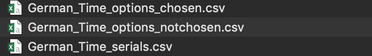
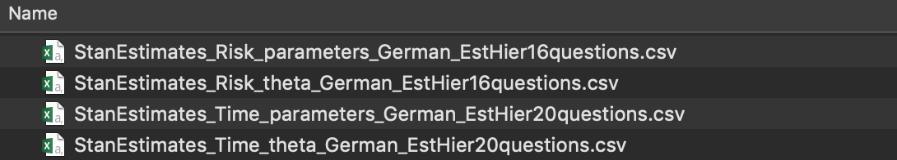
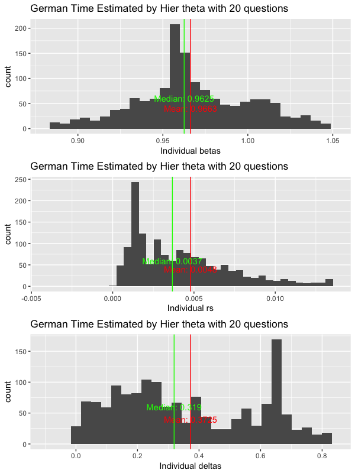
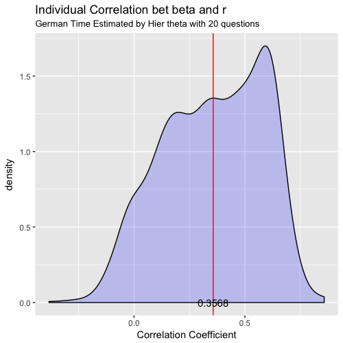

[](https://www8.gsb.columbia.edu/decisionsciences/)

### Dynamic Experiments for Estimating Preferences (DEEP)

In trying to understand choices, people would like to know the decision maker's underlying preferences. DEEP (Toubia et al, 2013) is a novel methodology to elicit individuals' risk (DEEP Risk) or time (DEEP Time) preferences by dynamically (i.e., adaptively) optimizing the sequences of questions presented to each subject, while leveraging information about the distribution of the parameters across individuals (heterogeneity) and modeling response error explicitly.

**To customize and launch your own DEEP survey, refer to our** [survey page](http://). When survey is completed by enough subjects, install the **DEEPEst** package and start estimation.

# DEEPEst

This R package provides functions to execute hierarchical Bayesian estimation for DEEP using [Stan](https://mc-stan.org) (via the **rstan** package). These high level functions will automatically call [Stan](https://mc-stan.org) functions so that you don't need to dive into them by yourself. There are also some functions for posterior analysis on estimates of both time and risk preferences parameters.

### Installation

To install from GitHub, please first install the **rstan** package and C++ toolchain with these [instructions](https://github.com/stan-dev/rstan/wiki/RStan-Getting-Started).
Then, you can install **DEEPEst** from GitHub using the **devtools** package by executing the following in R:

```r
devtools::install_github("ColumbiaCDS/DEEPEst")
```

If installation fails, please let us know by [filing an issue](https://github.com/ColumbiaCDS/DEEPEst/issues).

### Run Estimation

Download the original survey data csv file into your working directory `path`. And for illustration, let's say the working directory `path` here is "./DEEP Your_Name". 

Then, rename this original csv file to be "DEEP_{model}\_surveydata\_{project_name}.csv". Here, "{model}" should be either "Time" or "Risk" depending on your project and "{project_name}" should be a unique name indentifying this project. For example, you may name it as "DEEP_Time_surveydata_StudyNo1.csv".

Then execute the following:

```r
# For DEEP Time
library(DEEPEst)
Time_data_prepare(project_name = "StudyNo1", path = path, num_question = 12)
Stan_Time_Estimation(project_name = "StudyNo1", num_question_Est = 12, num_question = 12, type_theta = "Hier", path = )

# For DEEP Risk
library(DEEPEst)
Risk_data_prepare(project_name = "StudyNo1", path = path, num_question = 12)
Stan_Risk_Estimation(project_name = "StudyNo1", num_question_Est = 12, num_question = 12, type_theta = "Hier", path = )
```

For details about how to set these arguments and other functions involved, please click the arrows here for relevant functions:

<details><summary>Stan_Time_Estimation, Stan_Risk_Estimation</summary>

```r
Stan_Time_Estimation(project_name,
	num_question_Est,
	num_question,
	type_theta,
	path,
	save_out = T,
	chains=3,
	iter=1000,
	thin=3,
	adapt_delta=.9,
	max_treedepth=12,
	stepsize=1)

Stan_Risk_Estimation(project_name,
	num_question_Est,
	num_question,
	type_theta,
	path,
	save_out = T,
	chains=3,
	iter=1000,
	thin=3,
	adapt_delta=.9,
	max_treedepth=12,
	stepsize=1)
```

#### Description

The main functions to do estimation on DEEP Time and Risk data. This function will automatically call stan models. It will return a large stanfit object called "hier_time" if `save_out=FALSE`. Otherwise, return nothing but save the stanfit object into a local RData file as this example:


#### Arguments

* project_name: The name of this study. 
* num_question_Est: How many questions you want to use in estimation.
* num_question: How many questions are asked for each subject.
* type_theta: Type of scaling response noise parameter used in estimation, specify either "Global", "Individual" or "Hier".
* path: Full path for working directory.
* save_out: Whether save the stanfit object as a rdata file. The default is "TRUE".
* chains: A positive integer specifying the number of Markov chains. The default is 3.
* iter: A positive integer specifying the number of iterations for each chain (including warmup). The default is 1000.
* thin: A positive integer specifying the period for saving samples. The default is 3.
* adapt_delta: A double value between 0 and 1 controlling the accept probability in sampling. The default is 0.9.
* max_treedepth: A positive integer specifying how deep in tree exploration. The default is 12.
* stepsize: A double and positive value controlling sampler's behavior. The default is 1.

</details>

<details><summary>Time_data_prepare, Risk_data_prepare</summary>

```r
Time_data_prepare(project_name,
	path, 
	num_question,
	clean_time = T, 
	clean_side = T, 
	each_seconds = 3)

Risk_data_prepare(project_name,
	path, 
	num_question,
	clean_time = T, 
	clean_side = T, 
	each_seconds = 3)
```

#### Description

Read and denoise the original suvery output data. Only complete rows would be reserved. In addition, this function automatically drops those "unengaged" responses (noisy ones with only random choices, not involving utility consideration). Three csv files will be saved under directory indicated by `path` and used in estimation functions. Examples:


#### Arguments

* project_name: The name of this study. 
* path: Full path for working directory.
* num_question: How many questions are asked for each subject in this suvery.
* each_seconds: How many seconds spent on each question on average so that the observation would be considered as a reasonable response.
* clean_time: Logical value. Default is `TRUE` means you want to denoise the original data by dropping all responses which are completed within `num_question` times `each_seconds` seconds.
* clean_side: Logical value. Default is `TRUE` means you want to denoise the original data by dropping all responses which only contain one-side options, namely, only left or right options chosen.

</details>

<details><summary>Time_prepare_Stan, Risk_prepare_Stan</summary>

```r
Time_prepare_Stan(all_Stan_data,
	num_question_Est,
	subjectNumber)

Risk_prepare_Stan(all_Stan_data,
	num_question_Est,
	subjectNumber)
```

#### Description

After reading, processing and denoising necessary data. These functions will create an R list object containing all data to run estimation. Called by functions `Stan_Time_Estimation` and `Stan_Risk_Estimation`.

#### Arguments

* all_Stan_data: Data needed to be processed.
* num_question_Est: How many questions are going to be used in this estimation.
* subjectNumber: Number of subjects in this survey.

</details>

<details><summary>Time_index_Questions</summary>

```r
Time_index_Questions <- function(stan_data,
	subjectNumber,
	num_question)
```

#### Description

Index and arrange questions so that smaller-sooner and larger-later options would be arranged as expected. Called by function `Stan_Time_Estimation`.

#### Arguments

* stan_data: Data needed to be processed.
* subjectNumber: Number of subjects in this survey.
* num_question: How many questions are asked for each subject in this survey.

</details>

<details><summary>Risk_resetxy</summary>

```r
Risk_resetxy(g1g2)
```

#### Description

Prepare data and make sure the values of rewards `x` and `y` fall into the two situations of CPT model indicated in original paper: either `x>y>0|x<y<0`, or `x<0<y`. Called by function `Stan_Risk_Estimation`.

#### Arguments

* g1g2: One row with contents for two options in one Risk question. 

</details>

### Posterior Analysis

**Functions for posterior analysis would only work when stanfit object for this study `project_name` is saved under directory directory `path` after estimation.**
Please click the arrows below for relevant functions:

<details><summary>Time_save_stantocsv, Risk_save_stantocsv</summary>

```r
Time_save_stantocsv(project_name,
	num_question_Est,
	type_theta,
	path)

Risk_save_stantocsv(project_name,
	num_question_Est,
	type_theta,
	path)
```

#### Description

This function will save posterior point estimates for preferences from stanfit object to local csv files. Examples:


#### Arguments

* project_name: The name of this study. 
* num_question_Est: How many questions you want to use in estimation.
* type_theta: Type of scaling response noise parameter used in estimation, specify either "Global", "Individual" or "Hier".
* path: Full path for working directory.

</details>

<details><summary>Time_dist_estimates, Risk_dist_estimates</summary>

```r
Time_dist_estimates(project_name,
	num_question_Est,
	type_theta,
	path)

Risk_dist_estimates(project_name
	num_question_Est,
	type_theta,
	path)
```

#### Description

This function will plot the distributions of all parameter estimates across all subjects. Example:


#### Arguments

* project_name: The name of this study.
* num_question_Est: How many questions used in the estimation.
* type_theta: Type of scaling response noise parameter used in estimation, specify either "Global", "Individual" or "Hier".
* path: Full path for working directory.

</details>

<details><summary>Time_plot_cor, Risk_plot_cor</summary>

```r
Time_plot_cor(project_name,
	num_question_Est,
	type_theta,
	path,
	parameter1,
	parameter2)

Risk_plot_cor(project_name,
	num_question_Est,
	type_theta,
	path,
	parameter1,
	parameter2)
```

#### Description

For each subject, the function firstly computes the correlation coefficient between posterior sampling drawers of two parameters set by `parameter1` and `parameter2`. Then it draws the distribution of all correlation coefficients across all subjects. Example:


#### Arguments

* project_name: The name of this study.
* num_question_Est: How many questions used in the estimation.
* type_theta: Type of scaling response noise parameter used in estimation, specify either "Global", "Individual" or "Hier".
* path: Full path for working directory.
* parameter1 First parameter. Specify either "alpha", "sigma" or "lambda".
* parameter2 Second parameter. Specify another parameter in "alpha", "sigma" or "lambda".

</details>

### Reference

[Toubia, O., Johnson, E., Evgeniou, T., & Delquié, P. (2013). Dynamic experiments for estimating preferences: An adaptive method of eliciting time and risk parameters. Management Science, 59(3), 613-640.](https://pubsonline.informs.org/doi/abs/10.1287/mnsc.1120.1570)
